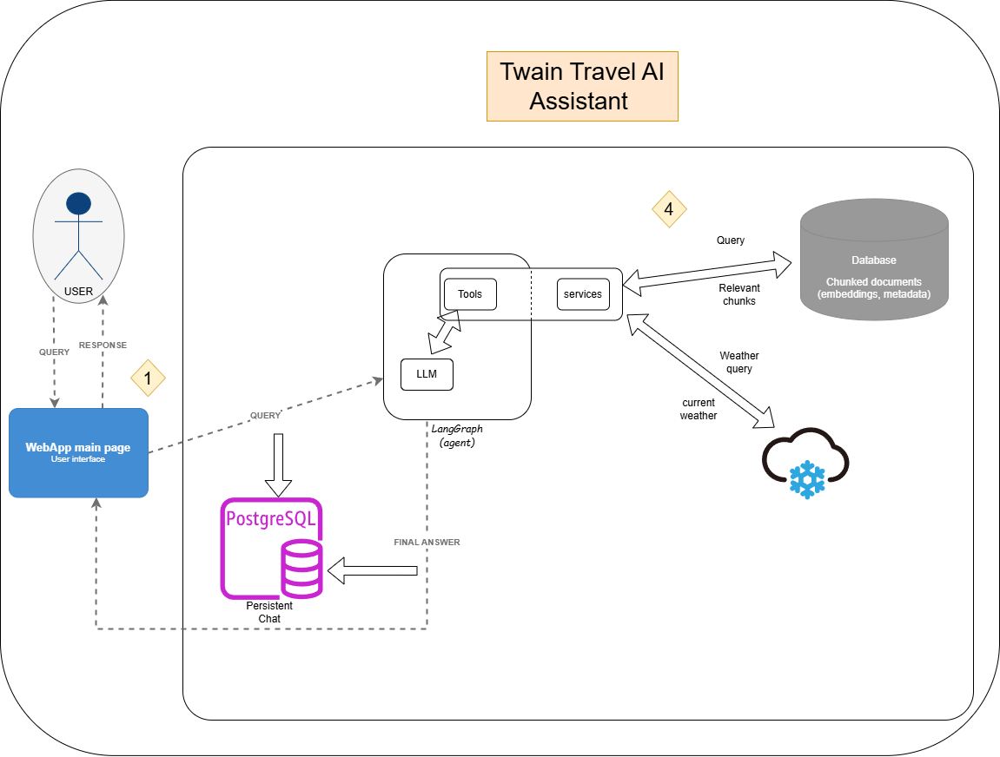

# Travel Advisor AI - Mark Twain's Innocents Abroad

An AI-powered travel assistant that combines Mark Twain's classic travel memoir "The Innocents Abroad" with real-time weather data to provide unique travel insights and recommendations.

[](https://www.python.org/downloads/)
[](https://opensource.org/licenses/Apache-2.0)

---
##  Table of Contents

- [Features](#features)
- [Architecture](#Architecture)
- [Setup Instructions](#setup-instructions)
- [API Documentation](#api-documentation)
- [Usage Examples](#usage-examples)
- [Unit and Integration Tests](#unit-and-integration-tests)
- [Project Structure](#project-structure)
- [Deployment](#deployment)
- [Troubleshooting](#troubleshooting)
- [Performance Analysis](#performance-analysis)
- [License](#license)
- [Acknowledgments](#acknowledgments)
- [Contact](#contact)

## Features

- **Literary Travel Insights**: Ask questions about locations, experiences, and observations from Mark Twain's "The Innocents Abroad"
- **Real-time Weather Information**: Get current weather data for any destination worldwide using OpenWeatherMap API
- **Intelligent Query Routing**: LangGraph-powered agent that automatically determines whether to use book knowledge, weather data, or both
- **Conversational Interface**: Natural language interaction with persistent conversation history stored in PostgreSQL
- **RAG-Powered**: Retrieval-Augmented Generation using FAISS vector store with semantic search over book chapters
- **Markdown Formatted Responses**: Beautiful, structured responses with proper headers, bold text, and lists

## Architecture


### Agent Workflow

```
User Query → Travel-Agent 
               ↓
        ┌──────┴──────┐
        ↓             ↓
  Twain Book Tool   Weather Tool
  (FAISS Search)    (API Call)
        ↓             ↓
        └──────┬──────┘
               ↓
         Travel-Agent
               ↓
        Format Response
               ↓
        Return to User
```
### Tech Stack 

- **Backend**: Flask (Python 3.10)
- **AI Framework**: LangChain + LangGraph
- **LLM**: Azure OpenAI (GPT-4o-mini)
- **Embeddings**: mixedbread-ai/mxbai-embed-large-v1 (Hugging Face)
- **Vector Store**: FAISS (in-memory)
- **Database**: PostgreSQL 17.5
- **Weather API**: OpenWeatherMap
- **Containerization**: Docker + Docker Compose

### Project Structure

```
Twain_Travel_AI_Assistant/
├── src/
│   ├── agents/                           # LangGraph agent implementation
│   │   ├── travel_agent.py               # Main agent workflow with tool routing
│   │   ├── agent_state.py                # State management for agent
│   │   ├── agent_run.py                  # Agent runner with conversation history
│   │   └── tools/                        # Agent tools
│   │       ├── weather_tool.py           # OpenWeatherMap integration
│   │       ├── twain_query_tool.py       # FAISS vector search
│   │       └── __init__.py               # Tool exports
│   ├── routes/                           # Flask API routes
│   │   ├── main_routes.py                # Home and health check endpoints
│   │   └── chat_routes.py                # Chat and conversation endpoints
│   ├── services/                         # Business logic layer
│   │   ├── book_vectorstore_service.py   # FAISS vector store management
│   │   ├── weather_service.py            # Weather API service
│   │   └── chat_service.py               # Conversation persistence
│   ├── templates/                        # HTML templates
│   │   ├── base.html                     # Base template
│   │   └── chat.html                     # Chat interface
│   ├── static/                           # Static assets
│   │   ├── css/style.css                 # Application styles
│   │   └── js/chat.js                    # Chat UI logic with markdown rendering
│   ├── data/                             # Data ETL
│   │   ├── gutenberg_downloader.py       # Book downloader and processor
│   │   └── faiss_index/                  # Stored FAISS index
│   ├── utils/                            # Utilities
│   │   ├── database.py                   # PostgreSQL connection management
│   │   ├── constants.py                  # Constants and error codes
│   │   └── prompts.py                    # System prompts
│   ├── app.py                            # Flask application factory
│   └── config.py                         # Configuration management
├── data/                                 # Data files
│   └── faiss_index/                      # FAISS vector store
├── logs/                                 # Application logs
├── tests/                                # Unit tests
│   ├── test_chat_service.py              # Chat service unit tests
│   ├── test_api_routes.py                # API routes unit tests
│   ├── test_agent_runner.py              # Agent runner unit tests
│   ├── test_database_integration.py      # Database integration tests
│   └── test_vectorstore_integration.py   # FAISS vector store integration tests
├── .env.example                          # Example environment configuration
├── requirements.txt                      # Python dependencies
├── run.py                                # Application entry point
├── Dockerfile                            # Docker configuration
├── docker-compose.yml                    # Docker Compose setup
└── README.md                             # Project document
```

## Setup Instructions

### Prerequisites

- Python 3.10
- PostgreSQL 17.5
- Azure OpenAI API access
- OpenWeatherMap API key

### Local Development

#### 1. Clone the Repository

```bash
git clone https://github.com/nomanarshad94/Twain_Travel_AI_Assistant.git
cd Twain_Travel_AI_Assistant
```

#### 2. Create Virtual Environment

```bash
python -m venv venv

# Windows
venv\Scripts\activate

# Linux/Mac
source venv/bin/activate
```

#### 3. Install Dependencies

```bash
pip install --upgrade pip
pip install -r requirements.txt
```

#### 4. Setup PostgreSQL Database

**Using PostgreSQL installed locally**

```bash
# Create database
createdb travel_advisor_db

# Or using psql
psql -U postgres
CREATE DATABASE travel_advisor_db;
CREATE USER agent_user WITH PASSWORD 'agent_user';
GRANT ALL PRIVILEGES ON DATABASE travel_advisor_db TO agent_user;
\q
```

#### 5. Configure Environment Variables

Create `.env` file from the example [.env.example](.env.example):

```bash
cp .env.example .env
```

Edit `.env` with your credentials and api keys.

#### 6. Download and Process the Book

The application will automatically download "The Innocents Abroad" from Project Gutenberg and create FAISS index on first run. To manually trigger:

```bash
python -m src.data.gutenberg_downloader
```

This will:
1. Download the book from Project Gutenberg
2. Clean and process the text
3. Split into semantic chunks with chapter metadata
4. Generate embeddings using the Hugging Face embedding model
5. Create and save FAISS vector index (in-memory vector store)

#### 7. Run the Application

**Development mode:**

```bash
python run.py
```

**Production mode with Gunicorn:**

```bash
gunicorn --workers 4 --bind 0.0.0.0:5000 --timeout 120 run:app
```

The application will be available at `http://localhost:5000`


## API Documentation

### Base URL

```
http://localhost:5000
```

### Endpoints

#### 1. Health Check

Check if the application is running.

```http
GET /health
```

**Response:**
```json
{
  "service": "Travel Advisor AI",
  "status": "healthy"
}
```

#### 2. Home Page

```http
GET /
```

Returns the landing page.

#### 3. Chat Interface

```http
GET /chat/
GET /chat/?conversation_id=<id>
```

Returns the chat interface. Optionally load a specific conversation.

**Query Parameters:**
- `conversation_id` (optional): ID of conversation to load

#### 4. Send Message

Send a message and get AI response.

```http
POST /chat/message
Content-Type: application/json
```

**Request Body:**
```json
{
  "message": "What did Mark Twain think about the Sphinx?",
  "conversation_id": "1"
}
```

**Response:**
```json
{
  "response": "Mark Twain found the Sphinx to be...",
  "conversation_id": "1"
}
```

**Status Codes:**
- `200 OK`: Success
- `400 Bad Request`: Invalid request (missing message)
- `500 Internal Server Error`: Server error

#### 5. Get All Conversations

Retrieve list of all conversations.

```http
GET /chat/conversations
```

**Response:**
```json
[
  {
    "id": 1,
    "title": "What did Mark Twain think about...",
    "created_at": "2025-01-15T10:00:00Z",
    "updated_at": "2025-01-15T10:05:00Z"
  },
  {
    "id": 2,
    "title": "Weather in Paris",
    "created_at": "2025-01-15T11:00:00Z",
    "updated_at": "2025-01-15T11:02:00Z"
  }
]
```

#### 6. Get Conversation Messages

Get all messages from a specific conversation.

```http
GET /chat/conversations/<conversation_id>
```

**Response:**
```json
[
  {
    "id": 1,
    "content": "What did Twain think about Paris?",
    "is_user": true,
    "timestamp": "2025-01-15T10:00:00Z"
  },
  {
    "id": 2,
    "content": "Mark Twain had mixed feelings about Paris...",
    "is_user": false,
    "timestamp": "2025-01-15T10:00:15Z"
  }
]
```

#### 7. Delete Conversation

Delete a conversation and all its messages.

```http
DELETE /chat/conversations/<conversation_id>
```

**Response:**
```json
{
  "message": "Conversation deleted successfully"
}
```

**Status Codes:**
- `200 OK`: Successfully deleted
- `404 Not Found`: Conversation not found

## Usage Examples

### Example Queries

The system intelligently handles three types of queries:

#### 1. Weather Queries (Any Location (city) Worldwide)

```
"What's the current weather in Paris?"
"Tell me about the weather in Tokyo"
"How's the weather in Sydney?"
```

**Sample Response:**
```
### Current Weather in Paris

**Temperature**: 15°C (59°F)
**Conditions**: Partly cloudy
**Humidity**: 65%
**Wind Speed**: 12 km/h

Perfect weather for exploring the city!
```

#### 2. Book Queries (Mark Twain's Travels)

```
"What did Mark Twain think about the Sphinx?"
"What were Twain's impressions of Italy?"
"Did Twain visit the Rome?"
"Tell me about Twain's experiences in Venice"
```

**Sample Response:**
```
### Mark Twain's Thoughts on the Sphinx
Mark Twain had quite a few observations about the Sphinx during his travels in Egypt, and his reflections are as witty as they are insightful. Here are some highlights from *The Innocents Abroad*:

[Includes relevant quotes from the book]
```

#### 3. Combined Queries (Book + Weather)

```
"I want to visit the places Twain went to in Italy - what's the weather like there now?"
"Show me Twain's favorite European cities and their current weather"
"What did Twain say about Rome and what's the weather there today?"
```

**Sample Response:**
```
Mark Twain's Observations on Rome


Mark Twain had a rather colorful and humorous perspective on Rome, as reflected in his travel memoir, "The Innocents Abroad." Here are some of his notable thoughts:

The Authority of Rome: Twain reflects on the historical significance of Rome, stating, “On those little sentences have been built up the mighty edifice of the Church of Rome; in them lie the authority for the imperial power of the Popes over temporal affairs.” He acknowledges the weight of history that hangs over the city.

The Ruins of Glory: He describes the remnants of the city, noting, “About his feet is spread the remnant of a city that once had a population of four million souls; and among its massed edifices stand the ruins of temples, columns, and triumphal arches that knew the Caesars.” Twain marvels at the grandeur of what once was, contrasting it with the present.

Travel Fatigue: Twain humorously laments the overwhelming nature of Rome's attractions, admitting, “I wished to write a real ‘guide-book’ chapter on this fascinating city, but I could not do it, because I have felt all the time like a boy in a candy-shop.” He felt lost among the multitude of sights and experiences.

A Comedic Encounter: In a witty exchange with a guide, Twain recalls, “The guide was bewildered—non-plussed. He walked his legs off, nearly, hunting up extraordinary things, and exhausted all his ingenuity on us, but it was a failure.” This highlights Twain's playful skepticism towards the tourist experience.

Current Weather in Rome


As for the weather in Rome today:

Temperature: 18.81°C (feels like 18.18°C)
Conditions: Scattered clouds
Humidity: 55%
Wind Speed: 1.54 m/s

So, if you're wandering the ancient streets of Rome, you can enjoy a pleasant day under some scattered clouds, perfect for exploring the ruins Twain so vividly described!
```


#### 4. Out-of-Domain Queries (Polite Refusal)

```
"Explain quantum physics"
"What's the capital of Australia?"
"How do I bake a cake?"
```

**Sample Response:**
```
I'm here to assist with travel-related inquiries and insights inspired by Mark Twain's travels and weather information. Unfortunately, I can't provide information about the capital of Australia. However, if you're interested in exploring travel experiences or weather in Australia or any specific locations Twain visited, feel free to ask!
```

### Using the Web Interface

1. **Start Conversation**: Type your question in the input box
2. **View History**: Previous conversations appear in the left sidebar
3. **Switch Conversations**: Click on any conversation to load it
4. **Delete Conversations**: Hover over a conversation and click the delete icon
5. **New Chat**: Click "New Chat" to start fresh

### Using cURL (API Testing)

```bash
# Send a message (new conversation)
curl -X POST http://localhost:5000/chat/message \
  -H "Content-Type: application/json" \
  -d '{"message": "What did Twain think about the Sphinx?", "conversation_id": "new"}'

# Send a follow-up message
curl -X POST http://localhost:5000/chat/message \
  -H "Content-Type: application/json" \
  -d '{"message": "What about Paris?", "conversation_id": "1"}'

# Get all conversations
curl http://localhost:5000/chat/conversations

# Get specific conversation messages
curl http://localhost:5000/chat/conversations/1

# Delete conversation
curl -X DELETE http://localhost:5000/chat/conversations/1
```

### Unit and Integration Tests

The project includes essential unit and integration tests covering core functionality. For unit tests, external dependencies are mocked to ensure isolated testing of business logic. Integration tests validate end-to-end functionality with actual database and vector store.
#### Running Tests
```bash
# Install dependencies
pip install -r requirements.txt

# Run all tests
pytest tests/ -v

# Run only unit tests (no external dependencies required)
pytest tests/test_chat_service.py tests/test_api_routes.py tests/test_agent_runner.py -v

# Run only integration tests (requires PostgreSQL and FAISS index)
pytest tests/test_database_integration.py tests/test_vectorstore_integration.py -v
```

**Test Coverage (19 tests total):**

- **Unit Tests (11 tests)** - Mock external dependencies, test business logic
  - `test_chat_service.py` - Chat service CRUD operations
  - `test_api_routes.py` - API endpoint validation
  - `test_agent_runner.py` - Agent message handling & error handling

- **Integration Tests (8 tests)** - Test actual database and vector store
  - `test_database_integration.py` - PostgreSQL operations, cascade deletes
  - `test_vectorstore_integration.py` - FAISS similarity search, retriever

## Deployment

### Via Docker Compose
- Deploy to any (virtual machine having internet access, AWS EC2, etc.):

#### 1. Ensure Environment Variables

Make sure your `.env` file is configured (see step 5 above).

#### 2. Build and Start Services

```bash
# Get repository
git clone https://github.com/nomanarshad94/Twain_Travel_AI_Assistant.git
cd Twain_Travel_AI_Assistant
# Build and start in detached mode
docker compose up --build -d
```
Docker will pull necessary images, build the app image, and start the services setup in [Docker Compose file](docker-compose.yml).
The app will be available on port 5000. It will setup postgres DB and download/process the book on first run.

#### 3. Monitor Logs
```bash

# View logs
docker compose logs -f web

# View only app logs
docker-compose logs -f web
```

#### 4. Verify Services

```bash
# Check running containers
docker compose ps

# Test health endpoint
curl http://localhost:5000/health
```

#### 5. Stop Services

```bash
# Stop services
docker compose down

# Stop and remove volumes (clean slate)
docker compose down -v
```

**Docker Services:**

- **postgres**: PostgreSQL 17.5 database with persistent volume
- **web**: Flask application with Gunicorn (2 workers, 60s timeout)

## Troubleshooting
### Common Issues
#### Database Connection Error

```
psycopg2.OperationalError: could not connect to server
```

**Solutions:**
- Check PostgreSQL is running: `pg_isready`
- Verify credentials in `.env` file
- Ensure database exists: `psql -l`
- Check `DB_HOST` (use `localhost` for local, `postgres` for Docker)

#### Azure OpenAI Error

```
openai.error.AuthenticationError: Incorrect API key provided
```

**Solutions:**
- Verify `AZURE_OPENAI_API_KEY` in `.env`
- Check `AZURE_OPENAI_ENDPOINT` format
- Verify `GPT_DEPLOYMENT_NAME` matches your Azure deployment
- Check API version is supported

#### Weather API Error

```
requests.exceptions.HTTPError: 401 Client Error: Unauthorized
```

**Solutions:**
- Verify `OPENWEATHERMAP_API_KEY` in `.env`

#### Memory Issues with Embeddings

```
RuntimeError: CUDA out of memory
```
**Solution:**
- Set `EMBEDDING_MODEL_DEVICE="cpu"` in `.env`
- Use smaller embedding model

## Performance Analysis

### Latency Overview

**Average Response Times:**

Tested on local machine with stable internet for 5 queries each
- Simple book queries: 2-4 seconds
- Weather queries: 2-3 seconds
- Combined queries: 4-8 seconds

**Main Bottlenecks:**
1. **Azure OpenAI API calls** (largest impact): ~3-6s per query due to multiple agent iterations with tools and response generation with GPT-4o-mini
2. **Weather API calls**: ~0.5-1.5s when fetching weather data x2 (for location to coordinates + current weather)
3. **Database operations**: ~300ms (minimal impact)

### Optimization Strategies

**Latency Reduction:**
- **Streaming responses** - Implement real-time token streaming (Suggested by Azure OpenAI)
- **Response caching** - Cache common queries, specially for weather queries, using Redis
- **Parallel tool execution** - Execute independent tools concurrently
- **Limit conversation history** - Load only last 10 messages instead of full history to reduce query tokens, latency and cost increase with tokens

**Cost Optimization:**
- **Model selection** - Use small models for lower cost, consider GPT-3.5-turbo or local LLMs for less complex queries
- **Response caching** - cost reduction with cache hits
- **Prompt optimization** - Reduce system prompt tokens
- **Token limits** - Set max_tokens~500 to prevent hallucinations and extra tokens (might reduce quality)
- **Smart history management** - Only include relevant history

**Scalability:**

- FAISS (in-memory): Consider migrating to managed vector DB for larger datasets
- PostgreSQL: increase connection pool size for higher concurrency
- Workers: Flask gunicorn workers for concurrency at scale

## License

Apache 2.0 License - see [LICENSE](LICENSE) file for more details.

## Acknowledgments

- **Mark Twain's "The Innocents Abroad"** from [Project Gutenberg](https://www.gutenberg.org/)
- **LangChain & LangGraph** for the agent framework
- **OpenWeatherMap** for weather data API
- **Azure OpenAI** for language models
- **Hugging Face** for embedding models

## Contact

For questions, issues, or suggestions:
- GitHub Issues: [Create an issue](https://github.com/nomanarshad94/Twain_Travel_AI_Assistant/issues)

---

**Built with inspiration from Mark Twain's travels. Happy exploring!**

---